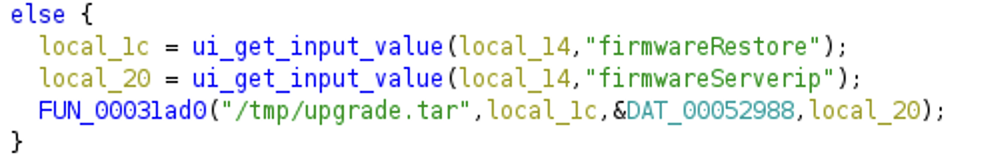
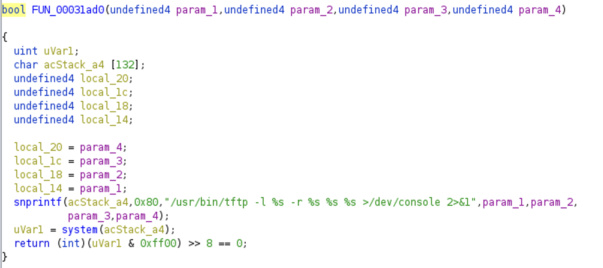

# upgrade_handler Command Injection

Netgear WG302v2 and WAG302v2 are vulnerable to an authenticated OS command injection vulnerability via the Upgrade Firmware functionality in the Web interface, using the metacharacters in the ngadmin.cgi?action=upgrade firmwareRestore or firmwareServerip parameter.

## The Vulnerability

In the upgrade_handler function, the firmwareRestore and firmwareServerip are read from user inputs, and send to tftp function (FUN_00031ad0).

In the tftp function, the two parameters are formatted in a string, which is used in system(). However, the parameters' values are not validated. Therefore an attacker can craft inputs starting with metacharacters like ';' to inject arbitary command.

## Timeline
